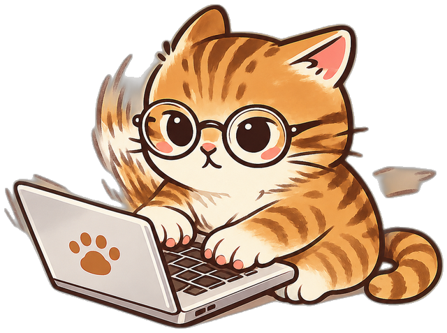

  

  

## ▸ who am i

I work with large language models and just about everything around them, from the parts people actually touch, like agents, RAG, dev tooling and a bit of embodied AI, down to the model tech and infrastructure running underneath. What I enjoy most is taking an idea and turning it into something real, whether that's a tool that's genuinely useful or a small side project I build just because it would be fun to have around. I care more about shipping something that runs and gets used than about keeping it as a tidy plan, so most of what you'll find here is stuff you can open and actually try.

 

## ▸ stats

<!-- contribution snake: generated to the output branch by .github/workflows/snake.yml (updates daily) -->
<picture>
  <source media="(prefers-color-scheme: dark)" srcset="https://raw.githubusercontent.com/Chasingwind-Z/Chasingwind-Z/output/github-snake-dark.svg"/>
  
</picture>
